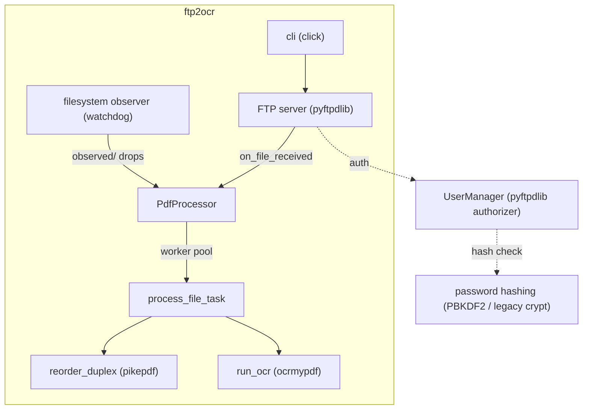
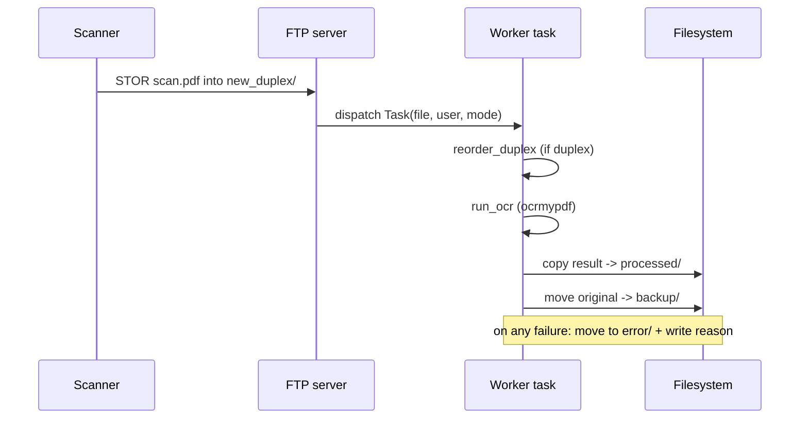

# Architecture

ftp2ocr is intentionally small: a single Python package with a handful of focused
modules, an FTP server in front, and OCR workers behind it.

## Components



| Module            | Responsibility                                                        |
| ----------------- | --------------------------------------------------------------------- |
| `cli`             | `serve`, `mkpasswd`, `healthcheck` subcommands and option handling.   |
| `pipeline`        | Routing, worker pool, FTP handler factory, filesystem observer.       |
| `ocr`             | `run_ocr` (ocrmypdf) and `reorder_duplex` (pikepdf).                  |
| `users`           | User list parsing, password hashing/verification, directory setup.    |
| `paths`           | Per-user directory layout (`PathFactory`).                            |
| `certs`           | Self-signed TLS certificate generation.                               |
| `stability`       | Wait until a file stops changing before processing it.                |

## Directory layout

For a base directory `/data` and a user `alice`, ftp2ocr creates:

```
/data
└── alice
    ├── new_simplex     # upload here for OCR
    ├── new_duplex      # upload here for reorder + OCR
    ├── new_raw         # upload here to skip OCR
    ├── observed        # FTP or filesystem drops, OCR
    ├── processed       # results (point Nextcloud here)
    ├── backup          # the uploaded originals
    └── error           # failures + a .txt explaining why
```

The FTP user's home directory is `alice/`; they can list and write only into the four
input directories. The output directories (`processed`, `backup`, `error`) are readable
but not writable over FTP.

## Processing pipeline

Each uploaded file is handled by **one self-contained worker task**, which makes the
flow atomic per file and easy to reason about. This replaces the previous chain of
`apply_async` callbacks.



Key behaviours:

- **Temp files** are created next to the original with a unique `.ftp2ocr-<pid>-<uuid>`
  suffix and always cleaned up, even on failure.
- **Collisions are avoided**: if `processed/` or `backup/` already contains the file,
  a timestamp suffix is added instead of silently overwriting.
- **Non-PDF uploads** and files dropped into unknown directories are moved to `error/`
  with an explanation rather than left behind.
- **`observed/` waits for the file to settle** (size unchanged between two probes) so a
  half-written drop is not processed prematurely.
- **Graceful shutdown** on SIGTERM/SIGINT stops the observer and drains the worker pool.

## Concurrency

OCR is CPU-bound, so work runs in a `multiprocessing` pool (default: 2 workers,
`--workers`). The pool uses the `spawn` start method for safety and recycles workers
(`maxtasksperchild`) to keep memory in check for long-running deployments. The FTP
server itself stays responsive because uploads are handed off asynchronously.

## Authentication

Passwords in the user list are stored as hashes. ftp2ocr understands two schemes:

- `pbkdf2_sha256$<iterations>$<salt>$<digest>` — modern, generated by `ftp2ocr mkpasswd`.
- classic `crypt(3)` hashes — verified via the optional `legacycrypt` package so that
  pre-v2 user files keep working.

Verification is constant-time to avoid timing side channels.
