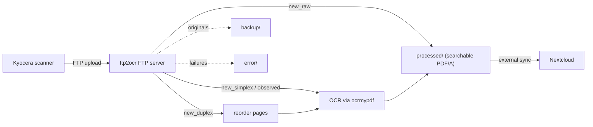

# ftp2ocr

**ftp2ocr** is a small, self-contained service that receives PDF scans over FTP(S) —
typically straight from a network scanner or multifunction printer such as a Kyocera —
runs OCR on them, and drops the searchable results somewhere a tool like
[Nextcloud](https://nextcloud.com/) can pick them up.

It is designed to be the glue between *"the scanner emailed me a pile of images"* and
*"I can actually search my paperwork"*.

## How it works

Your scanner is configured to upload scans to this server via FTP. **Which folder the
file is uploaded into decides what happens to it:**

| Folder         | What happens                                                        |
| -------------- | ------------------------------------------------------------------- |
| `new_simplex`  | Runs OCR over single-sided scans.                                   |
| `new_duplex`   | Re-orders interleaved duplex pages, then runs OCR.                  |
| `new_raw`      | Passes the PDF through untouched (no OCR).                          |
| `observed`     | Same as `new_simplex`, but also watches the filesystem for drops.   |

The results are written to the user's `processed/` folder, which you point Nextcloud
(or anything else) at.

## Features

- **FTP(S) server** built on `pyftpdlib`, with optional TLS and PASV support for NAT.
- **Per-user isolation** — every FTP user gets their own directory tree.
- **OCR** powered by [ocrmypdf](https://github.com/ocrmypdf/OCRmyPDF) (Tesseract under
  the hood), producing searchable PDF/A with rotation, deskew and cleanup.
- **Duplex re-ordering** for scanners that emit odd/even pages as two separate blocks.
- **Parallel processing** via a configurable worker pool.
- **Robust failure handling** — bad files land in `error/` with an explanation, never
  silently dropped.
- **Container-first** — ships as a Docker image built with `uv`.

## Where to start

- [Installation](installation.md) — run it with Docker.
- [Configuration](configuration.md) — every option, the user list, and TLS.
- [Usage](usage.md) — point your Kyocera at it and choose the right folder.
- [Upgrading](upgrading.md) — **read this when moving from v1 to v2.**
